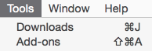
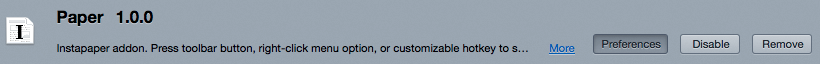
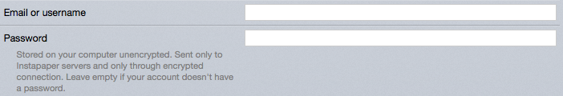
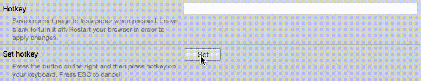

Paper 
=====

Simple Instapaper addon for Firefox. You can press toolbar button,
right-click menu option, or customizable hotkey to add current page
to Instapaper, or you can add links in bulk by shift-clicking them.
Supports notifications, off by default.

[Get it from Mozilla Addons][mozilla].

[mozilla]: https://addons.mozilla.org/en-US/firefox/addon/paper-for-instapaper/

Configuration
-------------

To use Paper you will need to provide it with your username and password.
They are sent only to Instapaper and only through an encrypted connection,
but they are both stored on your machine unencrypted.

Go to Tools→Add-ons or just press Shift+Command+A on Mac or Ctrl+Shift+A
on Windows/Linux:

Then you will see the Paper addon in the list. Click on “Preferences” button
and fill the form:

You can configure a hotkey to send the current page to Instapaper on press.
It is disabled by default. To enable, press `Set` button and then press your
hotkey on your keyboard. In this case, it is CTRL-K:

To disable, erase contents of `Hotkey` field.

Shift-clicking on a link sends it to Instapaper by default. You can change
the modifier key, or turn the feature off altogether.

There are more preferences, read their description to check whether you need
the features they provide or not.

When you are done, try to send [some article][article]. Press
![Send to Instapaper][default] button and if your credentials are OK, it will
change to ![the tick][success]. If it didn't, double check your preferences.

[default]: data/default-16.png
[success]: data/success-16.png

If you have *any* troubles with the addon, [write me back][email].

[article]: http://www.rollingstone.com/culture/features/ben-schlappig-airlines-fly-free-20150720
[email]: mailto:mail@yegortimoshenko.com

Credits
-------

Inspired by [InstapaperIt][instapaperit] for Safari. ![The tick][success]
is taken from there with the author's permission.

[instapaperit]: http://elasticthreads.tumblr.com/post/675433975/safari-extensions

The logo is based on the [Farm-Fresh newspaper][source] icon by
[FatCow Web Hosting][author] under [CC BY][license].

[author]: http://www.fatcow.com/free-icons/
[license]: https://creativecommons.org/licenses/by/3.0/us/deed.en
[source]: https://commons.wikimedia.org/wiki/File:Farm-Fresh_newspaper.png
