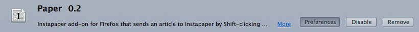
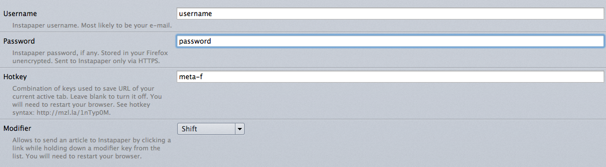

Paper 
=====

There was always the same damn problem with each of Instapaper browser
extensions: they were unpractical to add links in a bulk. You should
open the page and only then you could send it to your Instapaper.

Then I have found [one for Safari](http://elasticthreads.tumblr.com/post/675433975/safari-extensions),
great extension indeed, but I am Firefox kind of guy, so here it goes.

It’s pretty customizable, but by default you add links just by Shift-clicking
on them. A button is also there. You can also make a hotkey to save the current
page without pressing the button, but it is turned off by default.

Installation
------------

Avaliable via [Mozilla Addons](https://addons.mozilla.org/en-US/firefox/addon/paper-for-instapaper/).
You can download beta releases at
[GitHub Releases](https://github.com/somu/paper/releases).

Configuration
-------------

To use Paper, you need to provide your username and password. They are
sent to Instapaper only via HTTPS, but stored on your machine unencrypted.

Go to Tools→Add-ons or just press Shift+Command+A on Mac or Ctrl+Shift+A
on Windows/Linux:

Then you will see the Paper addon in the list. Click on “Preferences” button:

Then fill the form with your username and password. You can also specify
a hotkey to add the current page to Instapaper. See hotkey syntax
[here](https://developer.mozilla.org/en-US/Add-ons/SDK/High-Level_APIs/hotkeys).

Shift-clicking on link adds it to Instapaper by default. You can change
the modifier key, or turn the feature off.

When you are finished, try it out! Press the 
button and if your credentials are OK, it will change to .

Authors
-------

[Elasticthreads](http://elasticthreads.tumblr.com/post/675433975/safari-extensions)
is the author of the original idea. Icons are taken from his InstapaperIt
addon.

[Instapaper](http://instapaper.com) is the greatest read-it-later application
avaliable on the market. I tried both Readability and Pocket and returned back
to Instapaper. Thanks, [Marco](http://www.marco.org).

Icon is based on the [Farm-Fresh newspaper](https://commons.wikimedia.org/wiki/File:Farm-Fresh_newspaper.png)
icon by [FatCow Web Hosting](http://www.fatcow.com/free-icons/) which is under
[CC BY 3.0](https://creativecommons.org/licenses/by/3.0/us/deed.en) license.
